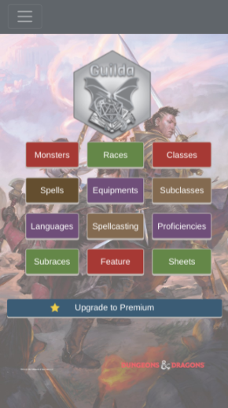

# Projeto Open House Laboratoria - Livros da Guilda

## Índice

* [Preâmbulo](#preâmbulo)
* [Definição do produto](#definição_do_produto)
* [Público alvo](#público_alvo)
* [Testes de Usabilidade](#testes_de_usabilidade)
* [Protótipos](#protótipos)

## Preâmbulo

RPG, sigla para Role Playing Game, é um gênero de jogo em que os jogadores assumem o papel de personagens imaginários, em um mundo com regras predeterminadas que é controlado por um mestre escolhido pelo grupo. Essas regras são compiladas e apresentadas aos jogadores através de séries de livros, que englobam diversos âmbitos do jogo, desde inimigos, características de personagens, armas, etc.

## Definição_do_produto

O MVP do site Livros da Guilda foi desenvolvido tendo como base o conceito mobile first, com foco em usuários que jogam o sistema de RPG D&D, seja um jogador, um mestre ou até um iniciante curioso sobre as informações do sistema de jogo. Nosso produto reúne informações contidas em livros do sistema D&D, essenciais para a jogabilidade, como o livro do jogador e livro dos monstros, permitindo que os usuários utilizem menos ou até dispensem o uso de livros físicos ou digitais no momento de jogo.
Devido ao tempo disponível, não foi possível implementar todas as funcionalidades desejadas, como as fichas de equipamentos, magias e etc, mas o objetivo é que o site ofereça o máximo de informações possíveis contidas nos livros de D&D.
Em uma versão 2.0, todas essas funcionalidades serão implementadas, bem como o estudo da viabilidade de adição de novos sistemas de jogo RPG detectados como populares em nossa pesquisa, como Vampiro: A máscara ou Lobisomem: O apocalipse.

## Público_alvo

Quem são os principais usuários de seu produto?
	Jogadores e mestres de RPG, independente do gênero.
Quais são os objetivos de seu usuário com relação ao seu produto?
	Dentre várias opções de informações disponibilizadas, jogadores desejam buscar informações sobre classes e raças de personagens e mestres desejam buscar informações sobre monstros.
Quais os dados mais importantes que eles querem ver em sua interface?
	Ficha dos monstros, ficha das raças e ficha das classes.
Quando utilizam ou utilizariam seu produto?
    Jogadores utilizariam principalmente no momento da montagem da ficha de personagem, mas também para tirar dúvidas durante as sessões. Já mestres utilizariam no momento da montagem da sua aventura e durantes as sessões, no momento em que os jogadores fossem enfrentar esses inimigos.

Personas

*1
Nome: Gabriel
Idade: 15 anos
Estado civil: Solteiro
Ocupação: Estudante de ensino médio
Características: Começou a jogar RPG com os amigos na escola. Mora com os pais em Brasília. Estuda inglês. Acha livros físicos "coisa de velho" e gostaria de uma opção mais prática para usar nos jogos de RPG.

*2
Nome: Olívia
Idade: 26 anos
Estado civil: Divorciada
Ocupação: Publicitária
Características: Mora em São Paulo com seu namorado. Joga RPG aos finais de semana com seus primos e amigos. Começou a jogar há pouco mais de um ano. Quer uma opção mais prática e rápida para consultar as informações do jogo.

*3
Nome: Diego
Idade: 39 anos
Estado civil: Casado
Ocupação: Técnico de segurança do trabalho
Características: Mora no Rio de Janeiro. Tem 1 um filho de 3 anos. Joga RPG há 20 anos com amigos 2 vezes por semana. Reclama do peso dos livros que precisa carregar para todos os jogos. Gostaria de algo mais prático para consultar nas sessões.

## Testes_de_usabilidade

Entrevistas com os usuários utilizando o Protótipo Inicial Digital

* Yuiti Ara - Os botões estão difíceis de visualizar e as fotos de fundo estão rodando muito rápido.
* Felipe dos Santos - Não achei nenhum problema, o mestre do meu grupo usaria sempre para ver a ficha dos monstros.
* Milena Gonzales - Achei o fundo do site muito bonito, mas as imagens estão "fortes" em relação aos botões.
* Marcos Vinícius Pradela - Muito legal, deixa as informações sempre à mão, principalmente para iniciantes.

* Problemas detectados nos testes->

-Trocamos os botões do aspecto vazado para cor sólida.

-Clareamos as imagens do fundo, aumentando o contraste entre o fundo e os botões.

-Diminuímos a velocidade de troca entre as imagens do carrossel.

## Protótipo

*Protótipo Digital Figma
[Link](https://www.figma.com/proto/KKjyZZBOiIZpGUMFkADLKjUc/Untitled?scaling=scale-down)

*Protótipo Digital Figma - Versão 2.0
[Link](https://www.figma.com/proto/TenIuftZ2HbqQPpEHA9wvf/Guilda-2.0?scaling=scale-down)
